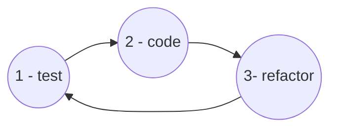
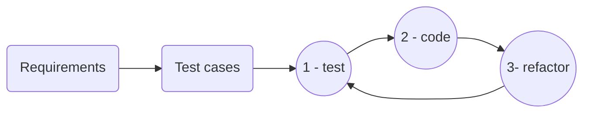
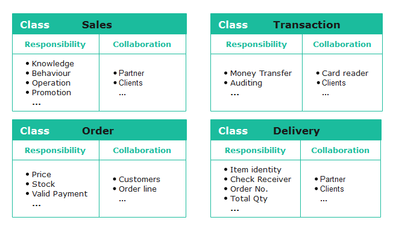
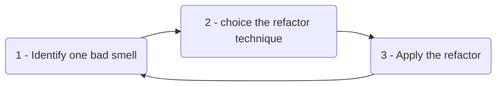
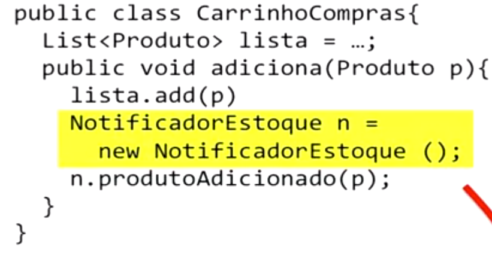

# About

Personal annotation of the course [TDD – Desenvolvimento de Software Guiado npor Testes](https://www.coursera.org/learn/tdd-desenvolvimento-de-software-guiado-por-testes) at Coursera.

# What is a high quality software?

- **Wrote for developer**
- **Clean code**:
    * Easy to read
    * Easy to understand
    * Easy to change

## Principals of a high quality code

- **KISS**: keep It Simple, Stupid! The solutions must be the more simple as it could be.
- **YAGNI**: You Aren't Gonna Need It! Do not anticipate code that you don't use now.
- **DRY**: Don't Repeat your self! Avoid duplicate code.
- **TDA**: Tell, Don't Ask! We do not change a attribute/data of a class B from a class A. Instead, the class A must tell to the class B to deal with her own data.

- **LoD**: Law of Demeter. We don't want to work with the "friend of my friend". I mean, if a class A needs class B, and class B needs class C, the class A do not need to know about class C.

- **SOLID principals**

- **Express the intention**: the name of variables, function, methods ans tests gave a hint about intention.

- **Design Patterns**

- **GRASP**: General Responsibility Assignment Software Principals.

# TDD: a approach to build high qualify code

**TDD** is a abbreviation for *Test Driven Development*.

TDD isn't a test technique. It is a software development technique where we make the tests before to design the code of our application.

## TDD cicles

- **test**: write a failing test.
- **code**: make the test pass.
- **refactor**: improve your code.

## 1 - Adding a test

Add a test to:

- Design the class interface
- Define the expected behavior

## 2 - Make the test pass

Make the test pass by:

- Implementing the class behavior
- Doing the simplest/dummy solution

## 3 - Refactor

Improve your code applying principals of a high quality code like SOLID, Design Patterns, etc. Please see [Refactoring Guro](https://refactoring.guru/pt-br/).

Basically:

- Clean your code
- Improve your class design

## Baby Steps

You must to add little behavior from one test to another.

Baby steps do not mean slow development, but often switch between tests and application code.

## TDD Principles

- **Fast feed back is good**: don't do a lot of code without test. Make a little of code, and test to get a fast feed back.

- **Easiest solution is the best**
- **Software design must be flexible and adaptive**
- **Tests bring security**
- **Tests are documentary**: tests are examples of using a class and is better then a doc description of the class.
- **All code is guilty until proven innocent**
- **It is more funny to test before**
# TDD: BDUF versus NoDUF

## BDUF 

**Big Design Up Front** is a software development approach in which the program's design is to be completed and perfected before that program's implementation is started. 

    Proponents of waterfall model argue that time spent in designing is a worthwhile investment, with the hope that less time and effort will be spent fixing a bug in the early stages of a software product's lifecycle than when that same bug is found and must be fixed later.

    Critics (notably those who practice agile software development) argue that BDUF is poorly adaptable to changing requirements and that BDUF assumes that designers are able to foresee problem areas without extensive prototyping and at least some investment into implementation.

[Wikipédia](https://en.wikipedia.org/wiki/Big_Design_Up_Front)

## NoDUF

**No Deign Up Front** is the oppose of BDUF.

## Which one to use with TDD?

- 1: Using TDD with BDUF?

- 2: avoid BDUF, I mean, do the NoDUF?

Neither, we need to anticipate the enough of our project, so we need the Enough Deign Up Front (EDUF) that is also called Rough Design Up Front (RDUF). That is a kind o Emergent Design.

The emphasis of RDUF is on WHAT TO DO and not on HOW TO DO.

RDUF + TDD = Dynamic Design

In most of the cases it is enough to do a *Class-responsibility-collaboration card* [(CRC)](https://en.wikipedia.org/wiki/Class-responsibility-collaboration_card) design.

## The refactor phase  

The refactor phase gives the dynamism to the code.

We can do refactor on:

- Variables and data
- Methods
- Classes
- Interfaces
- Subsystems
- Architecture

What to refactor? Follow the bad smell. 👃

- Things we suspect that are not right
- Things that if we do not correct right now, it will give us headache.
- Part of the code is just ugly.

The cicle of refactor:

# The smells of a code

The most common bad smell: 🤢

- Bad name of a function, class, variable, etc.
- Duplicate code
- Big method, or function
- Big class (the god one)
- if and switch commands
- jealous of a characteristic: copy a method from another class, in other words, the class do not delegate work and want to take care about a things that could be delegate to a appropriate class.
- Inappropriate intimacy: manipulate attributes of another class.
- Comments

# Test cases by responsibility

Having the enough requirement of your projetc, you need to think about tests that expect just the valid inputs, in other words, the "happy way", or the "positive test".

After, you need to think about invalid inputs, the "unhappy way", or the "negative test".

## Coding Dojo

Dojo, (pronounced Dojo) is a Japanese word and means "training place". Therefore, the Coding Dojo is nothing more than a "code training place", or "programming training place".

# Testing classes that has dependency of another classes

- In this case we call it an integration test.

- We can use TDD to define the interface between two classes. 

- In the cases where the object has a infrastructure dependency we can use mock objects.

## Creating a mock object

We need to create a mock object that our dependent class accept it.

In some cases is not possible to create a mock class. One example is when the dependency class is instantiate inside the dependent class: 

It is a good practice to receive the dependency class in the constructor (when a dependency is obligatory), or setter (when the dependency can be use in some cases or need to change).

That is called dependency injection. This method helps to let your software design more uncoupled.

To test the integration between two classes, is important to has a abstraction/interface.
So, our mock object will implement that interface.

Our mock object must:

- Mimic the interface of the dependency
- Simulate the behavior of our test case.
- Check all expect calls of the class.

There is some frameworks that helps to create mock objects.

## When we need to mock a class?

- Mock when dependency deals with external resources that is difficult to test, or has a complex logic.

- We need to mock a native class, or a framework class? No, this class could has a lot of details, you can just encapsulate the class to behavior as expect. In this way, you uncouple your class from this specific API class.

- Must I mock a dependency that do not must be expose to clients classes? No.

# Code smells and Refactor technics

- [Extract method](https://refactoring.guru/pt-br/extract-method)
- [Feature Envy](https://refactoring.guru/pt-br/smells/feature-envy)

